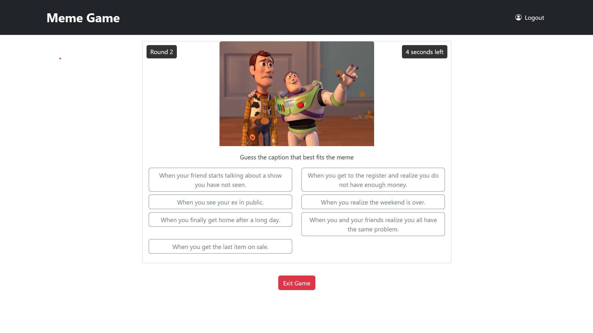
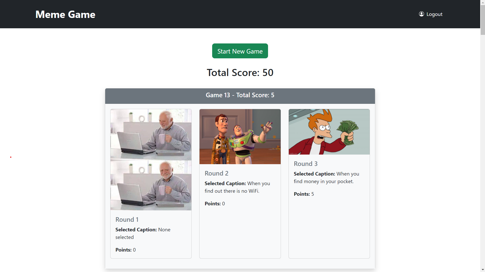

# Exam #1: "Meme Game"
## Student: s328715 Dashti Meelad 

## React Client Application Routes

- Route `/`: Displays the home page(`Game` component) where users can start a new game or view their game summaries.
- Route `/newgame`: Displays the `NewGame` component where users can play a new game.
- Route `/login`: Displays the `LoginComp` component where users can log in.

## Main React Components

- `Game` (in `Game.jsx`): 
  - **Purpose**: Displays the game summary and allows users to start a new game.
  - **Main Functionality**: 
    - Fetches and displays summaries of previous games for the logged-in user.
    - Allows users to start a new game, which navigates to the `NewGame` component.
    - Displays the total score of all games for the logged-in user.

- `NewGame` (in `NewGame.jsx`): 
  - **Purpose**: Manages the gameplay for a new game session.
  - **Main Functionality**: 
    - Displays memes and allows users to select captions.
    - Manages game rounds, including timing and scoring.
    - Shows a modal with the result of each round.
    - Displays the final score at the end of the game and allows users to restart the game.
    - Allows users to exit the game and navigate back to the home page.

## API Server

- POST `/api/sessions`: Authenticates a user and starts a session.
  - **Request Body**: `{ username, password }`
  - **Response Body**: User object if authentication is successful.
  - **Response Status Codes**: 
    - `200 OK`: Authentication successful.
    - `401 Unauthorized`: Authentication failed.

- DELETE `/api/sessions/current`: Logs out the current user.
  - **Response Body**: None.
  - **Response Status Codes**: 
    - `200 OK`: Logout successful.
    - `401 Unauthorized`: User is not logged in.

- GET `/api/sessions/current`: Gets the current logged-in user.
  - **Response Body**: User object if the user is logged in.
  - **Response Status Codes**: 
    - `200 OK`: User is logged in.
    - `401 Unauthorized`: User is not logged in.

- POST `/api/newgame`: Creates a new game with rounds and fetches random memes.
  - **Request Body**: `{ userId }`
  - **Query Parameters**: `excludeIds` (optional, comma-separated list of meme IDs to exclude)
  - **Response Body**: `{ gameId, rounds }`
  - **Response Status Codes**: 
    - `200 OK`: Game created successfully.
    - `500 Internal Server Error`: An error occurred.

- POST `/api/games/:id/complete`: Completes a game and updates the total score.
  - **Request Parameters**: `id` (game ID)
  - **Request Body**: `{ totalScore }`
  - **Response Body**: `{ message: 'Game completed successfully' }`
  - **Response Status Codes**: 
    - `200 OK`: Game completed successfully.
    - `500 Internal Server Error`: An error occurred.

- DELETE `/api/games/:gameId`: Deletes a game and all its rounds.
  - **Request Parameters**: `gameId`
  - **Response Body**: `{ message: 'Game and associated rounds deleted successfully' }`
  - **Response Status Codes**: 
    - `200 OK`: Game deleted successfully.
    - `500 Internal Server Error`: An error occurred.

- POST `/api/rounds/:roundId/complete`: Completes a round with the selected caption and score.
  - **Request Parameters**: `roundId`
  - **Request Body**: `{ selectedQuote, roundScore }`
  - **Response Body**: `{ message: 'Round completed successfully' }`
  - **Response Status Codes**: 
    - `200 OK`: Round completed successfully.
    - `500 Internal Server Error`: An error occurred.

- GET `/api/games/:gameId/rounds`: Gets all rounds for a specific game.
  - **Request Parameters**: `gameId`
  - **Response Body**: Array of rounds.
  - **Response Status Codes**: 
    - `200 OK`: Rounds fetched successfully.
    - `500 Internal Server Error`: An error occurred.
      
- GET `/api/users/:userId/games`: Gets all games for a specific user.
  - **Request Parameters**: `userId`
  - **Response Body**: Array of games.
  - **Response Status Codes**: 
    - `200 OK`: Games fetched successfully.
    - `500 Internal Server Error`: An error occurred.

- GET `/api/best-caption`: Gets the best captions for a meme.
  - **Query Parameters**: `id` (meme ID)
  - **Response Body**: `{ bestCaption }`
  - **Response Status Codes**: 
    - `200 OK`: Best caption fetched successfully.
    - `500 Internal Server Error`: An error occurred.

## Database Tables

- Table `users` - Stores information about registered users.
- Table `memes` - Stores meme pictures.
- Table `Captions` - Stores captions associated with memes.
- Table `games` - Stores game sessions played by users.
- Table `rounds` - Stores individual rounds within a game session.
- Table `MemeCaptions` - Associates captions with memes.

## Screenshots

## Users Credentials

- user1@example.com, password1 
- user2@example.com, password2 
